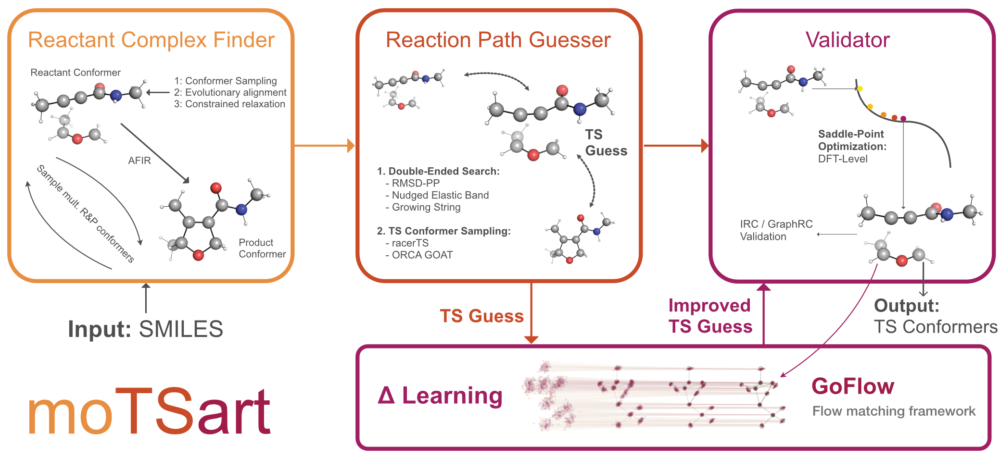
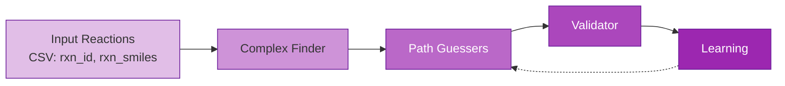

# moTSart

## Pipeline at a Glance

| Step | Module | Description |
|------|--------|-------------|
| 1 | [Complex Finder](pipeline/complex-finder.md) | Evolutionary algorithm + AFIR to find reactant complexes |
| 2 | [Path Guessers](pipeline/path-guessers.md) | RMSD-PP + RacerTS TS guess generation |
| 3 | [Validator](pipeline/validator.md) | xTB or DFT validation with IRC pathway confirmation |
| 4 | [Learning](pipeline/learning.md) | Data preparation and evaluatio workflow for TsOptNet |

## Quick Links

- [Installation](getting-started/installation.md) - Set up your environment
- [Quick Start](getting-started/quickstart.md) - Run your first reaction
- [Configuration](configuration/index.md) - Hydra-Zen config system
- [Cluster & HPC](cluster/index.md) - Running on SLURM clusters
- [Paper Reproduction Workflow](pipeline/paper-reproduction.md)
- [API Reference](reference/) - Auto-generated module documentation
