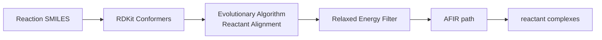

# Step 1: Complex Finder

The Complex Finder discovers optimal reactive molecular complexes from input reaction SMILES. It uses an evolutionary algorithm to arrange reactant molecules in 3D space, then screens candidates using the AFIR (Artificial Force Induced Reaction) method.

## How it works

1. **Conformer generation** - RDKit generates initial 3D conformers for each reactant
2. **Reactant Alignment** - An evolutionary algorithm optimizes the relative orientation and distance between reactant molecules to optimize forming-bond distances, steric clashes, and optionally place the reactive core in an angular aligment similar to the product. Reactant alignment is synonymous to distance optimization.
3. **xTB relaxation & energy ranking** - Constrained xTB relaxation of several conformers followed by lowest-energy selection.
4. **AFIR R --> P path** - Applies artificial forces to drive the reactants toward the product, thus generating the product conformer corresponding to the reactant, requried for the subsequent double-ended search in the path guesser module.

This procedure is performed for multiple iterations (specified by `n_EA_rounds`) to increase conformer diversity.



## Usage
```bash
python -m motsart.complex_finder.complex_finder env=local env.rxn_num=0 afir_cfg=test optim_cfg=test
```

## Configuration
The most important parameters are briefly described below. For more details, please check out the API reference.

### Optimization config (`optim_cfg`)

Controls the evolutionary algorithm parameters:

| Parameter | Default | Description |
|-----------|---------|-------------|
| `complex_method` | `"default"` | Method: `"default"` (EA) or `"rtsp_goflow"` (ML) |
| `n_EA_rounds` | `4` | Number of reactant complexes (RCs) that are saved & for which AFIR is run, and which are subsequently filtered down to `num_ts_for_validation` RCs for path guesser & validator. |
| `n_confs` | `1024` | Initial RDKit conformers to generate |
| `n_confs_after_product_similarity_filter` | `128` | Conformers with torsion angles similar to the product are kept during filtering. |
| `dist_population_size` | `1024` | Population size for distance optimization. E.g. if `n_confs_after_product_similarity_filter` is `128` but population size is set to `1024`, those `128` conformers are replicated times 8 |
| `dist_generations` | `64` | EA generations for distance optimization |
| `product_similarity_coef` | `10.0` | Coefficient for product similarity penalty term. This is optional but very useful for certain reaction types as it shrinks down the search space to plausible conformers. |
| `forming_bond_vdw_coef` | `1.25` | VdW radius multiplier for target forming bond length |


### AFIR config (`afir_cfg`)

Controls the AFIR path-guessing parameters:

| Parameter | Default | Description |
|-----------|---------|-------------|
| `fc_lower_bound` | `0.0` | Force constant lower bound (Hartree/Bohr^2) |
| `fc_upper_bound` | `3.0` | Force constant upper bound |
| `fc_init_upper` | `0.01` | Initial upper bound for binary search |
| `fc_binary_search_depth` | `10` | Binary search depth for force constant. Higher numbers result in more accurate TS guesses for AFIR. Accuracy only necessary if AFIR TS guess used downstream. |
| `num_ts_for_validation` | `4` | Number of Reactant Complexes (R&P) / TS candidates to forward to path guesser and finally validation. Based on filtering respective AFIR paths for those with lowest energy TSs. |

## Output

Results are saved to `results/R{rxn_id}/r/` and `results/R{rxn_id}/p/`:

- `final_complexes/` - Reactant complex XYZ files; passed to path guesser & validator
- `struct_xyzs/` - All generated conformer structures; useful for debugging & analysis
- `temp/` - Intermediate calculation files
