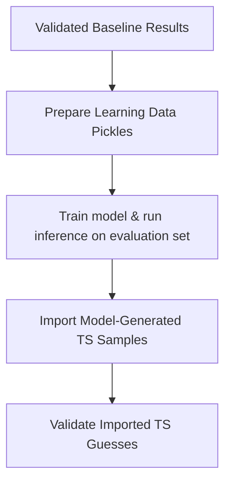

# Optional: Learning

This stage integrates model-generated TS guesses into the validation stage to be saddle point optimized and IRC validated. The goal is that the learned model optimizes the TS guess (very quickly) such that fewer expensive saddle point optimization cycles are necessary. The input TS guesses come from a path guesser such as RMSD-PP (second stage of the pipeline).

## Requirements

The workflow assumes you already have model-generated TS guesses (e.g. from an external GoFlow inference run) and want to evaluate them against baseline methods.

Required inputs:

- baseline validated results from Step 1 to Step 3
- model-generated TS samples mapped into a moTSart-style results tree

## Workflow



### 1. Prepare data pickles from baseline results

```bash
python -m motsart.learning.results_to_data_pkl
```

This converts baseline guess/ground-truth pairs into train/val/test pickles. Make sure to adjust the defined paths to match your environment.

### 2. Train model & run inference
In this step you need to train your model on the created training set and run inference. This is not fully automated in the pipeline since cluster settings might vary strongly between users. In our case CPU and GPU nodes were on separate clusters which required manual syncing.

### 3. Import model-generated samples into results tree

This helper script is espacially useful in case you require manual syncing as described above:

```bash
bash fetch_and_push_data_pkl_to_results.sh
```

It maps inferred TS samples from the pickle file containing them into the required folder structure `results*/R*/ts/learning/ts_to_validate/` by running the module `motsart.learning.data_pkl_to_results`.

### 4. Validate inferred TS guesses

```bash
sbatch validation_goflow.sh
```

This runs the standard validator pipeline on the inferred TS guesses. Please adjust this to your setting.

## Reproducibility guide

For an environment-agnostic paper workflow template, see [Paper Reproduction Workflow](paper-reproduction.md).
