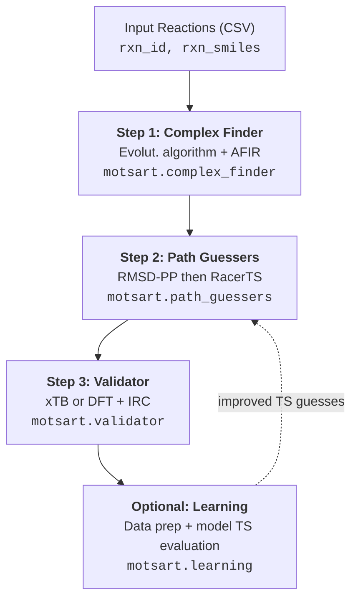

# Pipeline Overview

Multi-stage pipeline of moTSart for transition-state discovery. Each stage consumes artifacts from the previous stage.

## Architecture



## Main abstractions

### PathHandler

`PathHandler` (`motsart.common`) is the central path utility used across all stages.

### Configuration

All runtime entrypoints use Hydra-Zen-backed config stores. See [Configuration](../configuration/index.md).

## Module summary

| Module | Entry Point | Purpose |
|--------|------------|---------|
| `complex_finder` | `python -m motsart.complex_finder.complex_finder` | Find reactant complexes |
| `path_guessers.rmsd_pp` | `python -m motsart.path_guessers.rmsd_pp.rmsd_pp_reaction_path_guesser` | Generate initial TS guesses |
| `path_guessers.ts_conf_sampler` | `python -m motsart.path_guessers.ts_conf_sampler` | Refine RMSD-PP guesses via RacerTS |
| `validator` | `python -m motsart.validator.base_validator` | Validate TS guesses + IRC |
| `learning.results_to_data_pkl` | `python -m motsart.learning.results_to_data_pkl` | Build AL training/eval data |
| `learning.rtsp_guesser` | `python -m motsart.learning.rtsp_guesser` | Multihead RTSP guess generation |

## Results directory structure

Each reaction `R{rxn_id}` has its own subtree:

```
results*/
└── R{rxn_id}/
    ├── r/
    │   ├── temp/
    │   ├── struct_xyzs/
    │   └── final_complexes/
    ├── p/
    ├── ts/
    │   ├── rmsd_pp/
    │   ├── racer_ts/
    │   └── learning/
    └── validation/
        ├── rmsd_pp/
        ├── racer_ts/
        └── learning/
```
