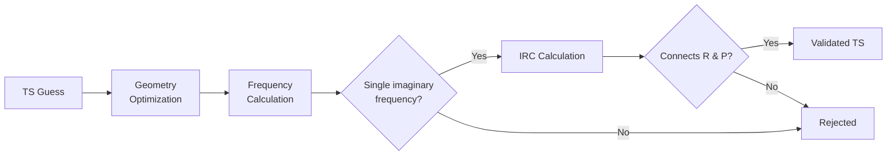

# Step 3: Validator

The Validator takes TS guess geometries from path guessers and validates them with quantum chemistry calculations. A TS is accepted if it has one imaginary frequency and the IRC check matches reaction connectivity.

## Validation process



## Available validators

### GFN2-xTB validator

Fast semi-empirical validation.

```bash
python -m motsart.validator.base_validator env=test validator_cfg=test validator=xtb env.rxn_num=0
```

### DFT validator (ORCA)

More accurate but slower.

```bash
python -m motsart.validator.base_validator env=local validator_cfg=local validator=dft env.rxn_num=0
```

!!! note
    ORCA must be installed and configured in `env.orca_path`.

### MLIP validator (OMol25, via ORCA ExtOpt)

Drives ORCA's TS optimizer with a FAIRChem OMol25 machine-learned interatomic
potential (default: `eSEN-sm-conserving`) through ORCA's `otool_external`
(`! ExtOpt`) interface. Energies and gradients come from the MLIP while ORCA's
own `OptTS`/`IRC`/`NumFreq` drive the geometry, so the engine is swappable with
`xtb`/`dft` and nothing else changes.

```bash
python -m motsart.validator.base_validator env=local validator_cfg=local validator=mlip env.rxn_num=0
```

!!! note
    Requires `fairchem-core` + `torch` in the environment, and access to the eSEN
    checkpoint (HuggingFace-gated registry name `esen-sm-conserving-all-omol`, or a
    local `*.pt` via `MOTSART_MLIP_MODEL`). The device is auto-selected (CUDA if
    available, else CPU). The MLIP runs gas-phase (no implicit solvent). The
    external-tool wrapper lives at
    `src/motsart/validator/orca_validator/orca_external_tools/mlip_external.py`;
    see [`experiments/`](https://github.com/heid-lab/motsart/tree/main/experiments)
    for engine-comparison run/analysis scripts and a no-GPU plumbing test.

## Configuration

### Validator config (`validator_cfg`)

| Parameter | Description |
|-----------|-------------|
| `SP_maxcore` | Maximum memory per core (MB) for single-point calculations |
| `SP_nprocs` | Number of parallel processes |
| `SP_MaxIter` | Maximum optimization iterations |
| `IRC_MaxIter` | Maximum IRC iterations |
| `skip_full_irc` | If `true`, use heuristic IRC via graphRC only |
| `path_guessers_to_validate` | List of TS methods to validate |
| `require_no_extra_bonds` | graphRC strictness. If `false` (default), a TS passes when all *expected* bond changes are recovered, tolerating extra (unexpected) ones; if `true`, any extra bond change also rejects the TS |

## Computing statistics

When you ran the pipeline, e.g. in parallel on a cluster for hundreds of reactions, you want to check statistics on success metrics of SP optimization or IRC validation.
The custom script below was used to compare two different runs: guesses generated with GoFlow (TsOptNet in the paper) and those from another path guesser, such as RMSD-PP.
Please adjust it to your liking.

```bash
python -m motsart.validator.compute_stats \
  --cluster-folder /data/results \
  --learning-folder /home/lgalustian/projects/motsart/results_goflow \
  --validator DFTValidator \
  --output-csv /home/lgalustian/projects/motsart/results_goflow/stats_al.csv \
  --cluster-ts-method racer_ts \
  --al-ts-method learning \
  --mode both
```

## Output

Results are saved to `results*/R{rxn_id}/validation/{method}/`:

- optimized TS geometries
- frequency outputs
- IRC trajectories
- per-guess validation status CSV
